## 代码生成器说明

### 参数界面说明


| 界面名称         | 对应生成结构体结构体名称 | 中文说明                        | 备注                                                         |
| ---------------- | ------------------------ | ------------------------------- | ------------------------------------------------------------ |
| `Struct名称`     | `StructName`             | 结构体名称                      | `server/model` 文件夹下的结构体文件中，结构体的名称，首字母必须**大写**。 |
| `tableName`      | `TableName`              | 指定表名(非必填)                | 数据库中生成的与结构体对应的数据表名。                       |
| `Struct简称`     | `PackageName`            | 简称会作为入参对象名和路由group | 用于结构体作为参数时的名称，以及路由 group 名称。这里一般与**Stuct名称**对应，但是首字母小写。 |
| `Struct中文名称` | `Abbreviation`           | 中文描述作为自动api描述         | 作为自动api描述，也是左侧菜单显示时的默认菜单名。            |
| `文件名称`       | `Description`            | 生成文件的默认名称              | 使用 xxx_xxx 形式命名。生成后端代码时，model下的文件名会用这里的命名。 |
| `自动创建api`    | `AutoCreateApiToSql`     | 自动创建api记录                 | 选中，如果不选则不会自动创建api表，需要自己去api管理里面手动增加对应路由。 |
| `自动移动文件`   | `AutoMoveFile`           | 自动移动文件                    | 自动移动到项目默认的路径                                     |

### 字段界面说明

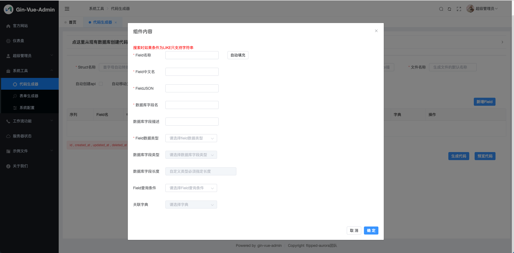

| 组件内容名称     | 对应生成结构体结构体名称 | 中文说明                 | 备注                                                         |
| ---------------- | ------------------------ | ------------------------ | ------------------------------------------------------------ |
| `Field名称`      | `FieldName`              | 结构体名称               | struct结构体中的字段名称，首字母**大写**                     |
| `Field中文名`    | `FieldDesc`              | 结构体中文名称           | 对应struct结构体tag中的comment字段值，也是数据列表展示表格的表头名称。 |
| `FieldJSON`      | `FieldJson`              | golang struct tag `json` | 对应struct结构体tag中的json字段值。在使用struct对象调用某个字段时，使用“对象.json字段值” |
| `数据库字段名`   | `ColumnName`             | 数据库字段名             | 对应数据库中的字段名称                                       |
| `数据库字段描述` | `Comment`                | 数据库备注               | 对应数据库中的列Comment值                                    |
| `Field数据类型`  | `FieldType`              | 字段对应golang数据类型   | 对应struct结构体中的字段类型                                 |
| `数据库字段类型` | `DataType`               | 字段数据类型             | 对应生成的数据表中的字段类型                                 |
| `数据库字段长度` | `DataTypeLong`           | 字段数据类型长度         | 对应生成的数据表中的字段长度                                 |
| `Field查询条件`  | `FieldSearchType`        | 搜索类型                 | 用于实现该对象数据列表的条件查询                             |
| `关联字典`       | `DictType`               | 关联字典标记             |                                                              |


## 1. 生成一步到位代码包

### 1.1 自行设计业务基础结构体模型

- 点击左侧菜单中的 **系统工具 → 代码生成器** 
- 填写好 `Struct名称` ` tableName` `Struct简称` `Struct中文名称` `文件名称` 空格
- 选择好 `自动创建api` `自动移动文件` 按钮

- 点击 **新增Field** 按钮，为数据表、struct结构体创建字段,  具体请看[字段界面说明](#字段界面说明)。

### 1.2 从数据库的选择表进行生成结构体

- 点击左侧菜单中的**系统工具** > **代码生成器** ,代码生成器是用来生成CURD代码的。

- 点击 **点这里从现有数据库创建代码**

- 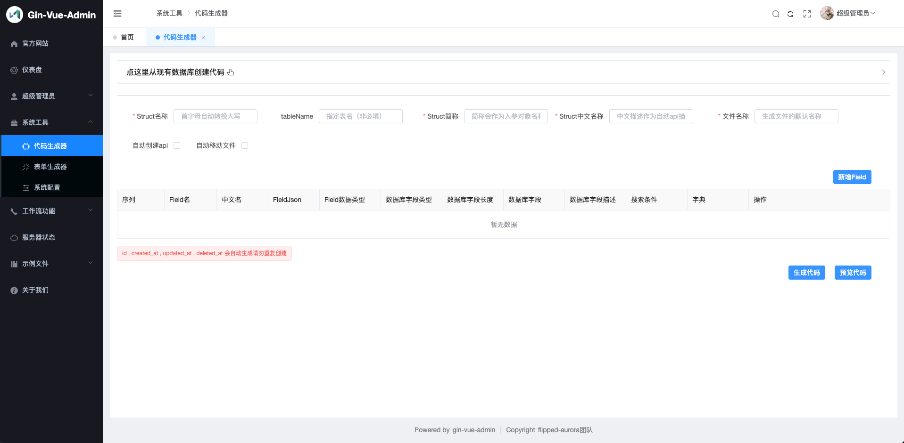

- 选择 **数据库名** 以及 **表名**

- 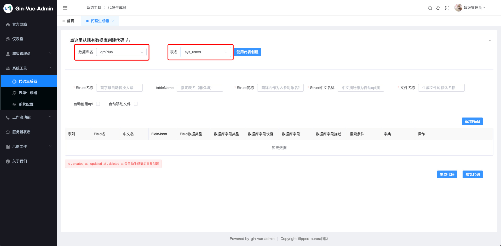

- 点击**使用此表创建**

- 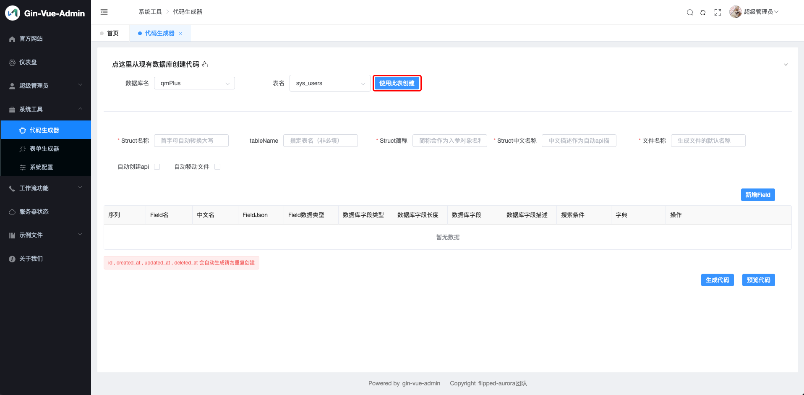

- 自行编辑好各个`Filed`的所需的搜索条件, 需要关联的字典, 或者其他自己要修改的地方点击编辑进行修改.

- 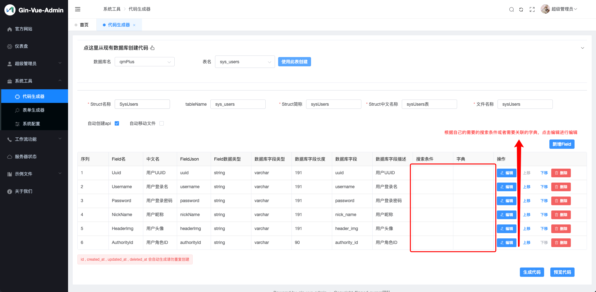

  


### 1.3  点击生成代码按钮

:::info 注意

完成1.1或1.2步骤操作, 其中一个操作喔!

:::


- 点击后就可以看到左下角或者下载内容里有一个下载好了的`ginvueadmin.zip `文件

- 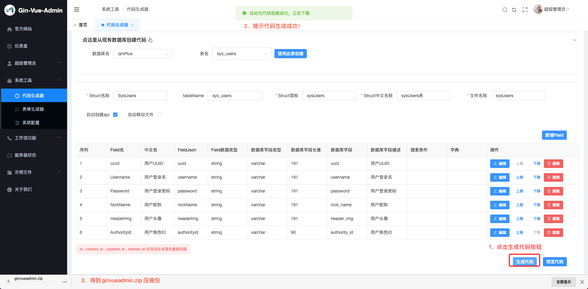

 解压`ginvueadmin.zip `后会看到里面有个 autoCode 文件夹，autoCode 里的 `server` 文件夹为自动生成的后端代码，`web` 文件夹为自动生成的前端代码。


:::info 注意

[PackageName](#packagename) (文件夹自建）--> 代表图片上的sysUsers

:::

| 图片路径                                         | 移动到对应路径 (web/view/sysUsers目录下的sysUsers文件夹需要自己新建) |
| ------------------------------------------------ | ------------------------------------------------------------ |
| `autoCode/server/sysUsers/service/sysUsers.go`   | `server/service/sysUsers.go`                                 |
| `autoCode/server/sysUsers/router/sysUsers.go`    | `server/router/sysUsers.go`                                  |
| `autoCode/server/sysUsers/request/sysUsers.go`   | `server/model/request/sysUsers.go`                           |
| `autoCode/server/sysUsers/model/sysUsers.go`     | `server/model/sysUsers.go`                                   |
| `autoCode/server/sysUsers/api/sysUsers.go`       | `server/api/sysUsers.go`                                     |
| `autoCode/web/sysUsers/workflowForm/sysUsers.go` | `web/src/view/sysUsers/sysUsersWorkflowForm.go`<br /> (文件需要重命名, 此文件服务于工作流模板) |
| `autoCode/web/sysUsers/table/sysUsers.go`        | `web/src/view/sysUsers/sysUsers.go`                          |
| `autoCode/web/sysUsers/form/sysUsers.go`         | `web/src/view/sysUsers/sysUsersForm.go` (文件需要重命名)     |
| `autoCode/web/sysUsers/api/sysUsers.go`          | `web/src/api/sysUsers.go`                                    |

### 1.4 预览代码

:::info 注意

此功能需要在 [v2.3.9](https://github.com/flipped-aurora/gin-vue-admin/tree/v2.3.9) 之后的版本才会有喔, 不包含v2.3.9!

:::


- 效果预览
- 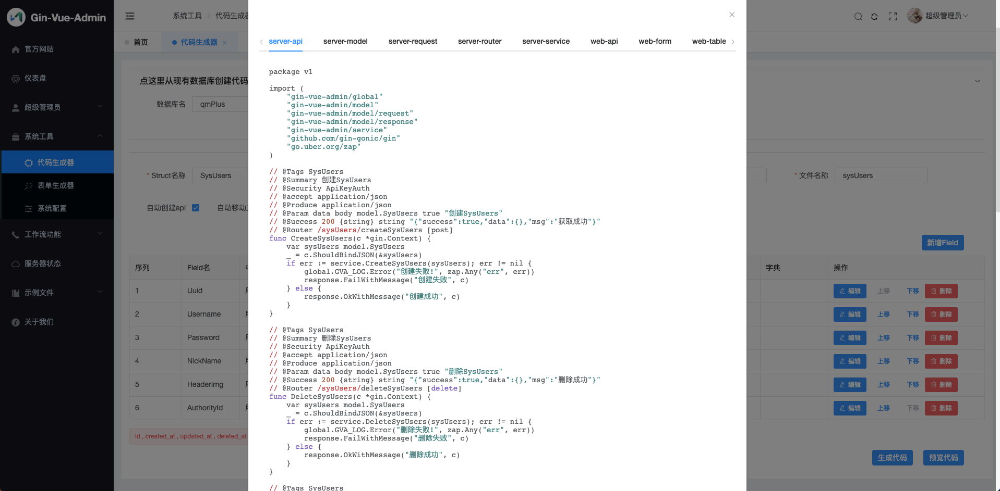

### 1.5 自动移动文件

- 操作指引

- 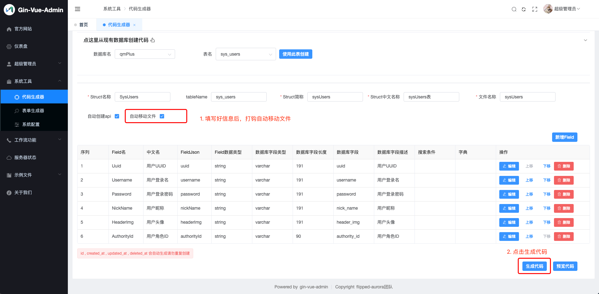

- 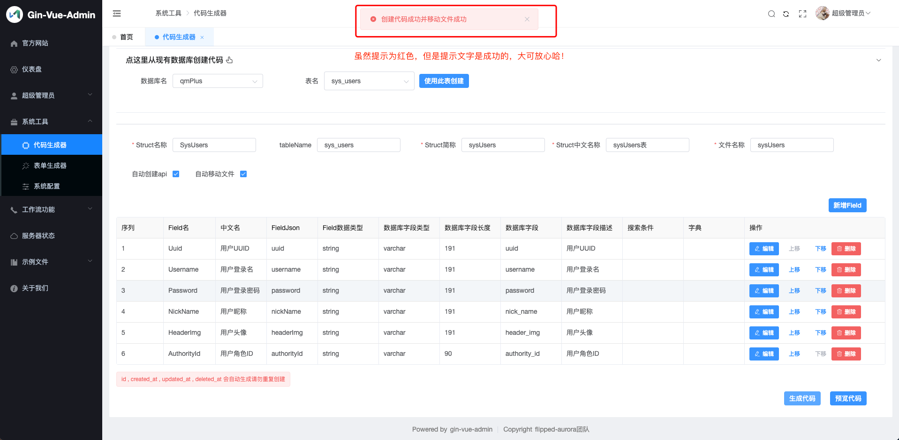

- 芜湖,起飞!!!!!! 这样不用手动去解压文件和移动文件, 太舒服了!
  
- 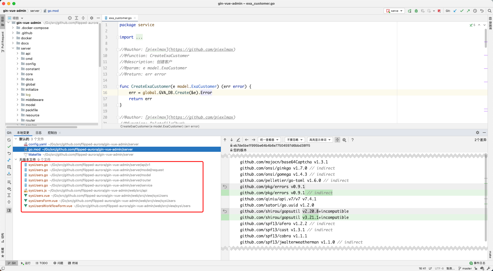

## 2. 注册路由和数据库表

### 2.1 注册路由

[server/initialize/router.go](https://github.com/flipped-aurora/gin-vue-admin/blob/master/server/initialize/router.go)

```go
package initialize

import (
	_ "gin-vue-admin/docs"
	"gin-vue-admin/global"
	"gin-vue-admin/middleware"
	"gin-vue-admin/router"
	"github.com/gin-gonic/gin"
	"github.com/swaggo/gin-swagger"
	"github.com/swaggo/gin-swagger/swaggerFiles"
	"net/http"
)

// 初始化总路由

func Routers() *gin.Engine {
	var Router = gin.Default()
	Router.StaticFS(global.GVA_CONFIG.Local.Path, http.Dir(global.GVA_CONFIG.Local.Path)) // 为用户头像和文件提供静态地址
	// Router.Use(middleware.LoadTls())  // 打开就能玩https了
	global.GVA_LOG.Info("use middleware logger")
	// 跨域
	Router.Use(middleware.Cors())
	global.GVA_LOG.Info("use middleware cors")
	Router.GET("/swagger/*any", ginSwagger.WrapHandler(swaggerFiles.Handler))
	global.GVA_LOG.Info("register swagger handler")
	// 方便统一添加路由组前缀 多服务器上线使用
	PublicGroup := Router.Group("")
	{
		router.InitBaseRouter(PublicGroup) // 注册基础功能路由 不做鉴权
		// 不需要鉴权的路由在这里行代码下面写
		router.InitSysUsersRouter(PublicGroup) // 此代码为示范
	}
	PrivateGroup := Router.Group("")
	PrivateGroup.Use(middleware.JWTAuth()).Use(middleware.CasbinHandler())
	{
		router.InitApiRouter(PrivateGroup)                   // 注册功能api路由
		router.InitJwtRouter(PrivateGroup)                   // jwt相关路由
		router.InitUserRouter(PrivateGroup)                  // 注册用户路由
		router.InitMenuRouter(PrivateGroup)                  // 注册menu路由
		router.InitEmailRouter(PrivateGroup)                 // 邮件相关路由
		router.InitSystemRouter(PrivateGroup)                // system相关路由
		router.InitCasbinRouter(PrivateGroup)                // 权限相关路由
		router.InitCustomerRouter(PrivateGroup)              // 客户路由
		router.InitAutoCodeRouter(PrivateGroup)              // 创建自动化代码
		router.InitAuthorityRouter(PrivateGroup)             // 注册角色路由
		router.InitSimpleUploaderRouter(PrivateGroup)        // 断点续传（插件版）
		router.InitSysDictionaryRouter(PrivateGroup)         // 字典管理
		router.InitSysOperationRecordRouter(PrivateGroup)    // 操作记录
		router.InitSysDictionaryDetailRouter(PrivateGroup)   // 字典详情管理
		router.InitFileUploadAndDownloadRouter(PrivateGroup) // 文件上传下载功能路由
		router.InitWorkflowProcessRouter(PrivateGroup)       // 工作流相关接口
		router.InitExcelRouter(PrivateGroup)                 // 表格导入导出
		
		// 需要鉴权的路由在这里行代码下面写
		router.InitSysUsersRouter(PrivateGroup) // 此代码为示范
	}
	global.GVA_LOG.Info("router register success")
	return Router
}
```

### 2.2 注册数据库表

[server/initialize/gorm.go](https://github.com/flipped-aurora/gin-vue-admin/blob/master/server/initialize/gorm.go)

```go
package initialize

import (
	"gin-vue-admin/global"
	"gin-vue-admin/initialize/internal"
	"gin-vue-admin/model"
	"go.uber.org/zap"
	"gorm.io/driver/mysql"
	"gorm.io/gorm"
	"gorm.io/gorm/logger"
	"os"
)

//@author: SliverHorn
//@function: Gorm
//@description: 初始化数据库并产生数据库全局变量
//@return: *gorm.DB

func Gorm() *gorm.DB {
	switch global.GVA_CONFIG.System.DbType {
	case "mysql":
		return GormMysql()
	default:
		return GormMysql()
	}
}

// MysqlTables
//@author: SliverHorn
//@function: MysqlTables
//@description: 注册数据库表专用
//@param: db *gorm.DB

func MysqlTables(db *gorm.DB) {
	err := db.AutoMigrate(
		model.SysUser{},
		model.SysAuthority{},
		model.SysApi{},
		model.SysBaseMenu{},
		model.SysBaseMenuParameter{},
		model.JwtBlacklist{},
		model.SysDictionary{},
		model.SysDictionaryDetail{},
		model.ExaFileUploadAndDownload{},
		model.ExaFile{},
		model.ExaFileChunk{},
		model.ExaSimpleUploader{},
		model.ExaCustomer{},
		model.SysOperationRecord{},
		model.WorkflowProcess{},
		model.WorkflowNode{},
		model.WorkflowEdge{},
		model.WorkflowStartPoint{},
		model.WorkflowEndPoint{},
		model.WorkflowMove{},
		model.ExaWfLeave{},
    
		// 在这里写模型的代码, 
		model.SysUsers{}, // 此代码为示范
		// 或者这样写, 根据自己的喜欢进行选择
		new(model.SysUser), // 此代码为示范
	)
	if err != nil {
		global.GVA_LOG.Error("register table failed", zap.Any("err", err))
		os.Exit(0)
	}
	global.GVA_LOG.Info("register table success")
}
```

## 3.配置目录菜单

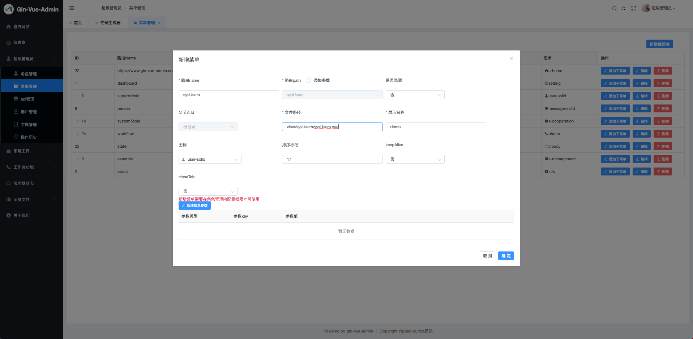

进入系统 超级管理员 → 菜单管理 菜单，点击 **新增根菜单** 按钮，配置菜单信息。

- 路由name：对应进入列表显示页面时的访问路径
- 路由path：选中后边的“添加参数”后才可以输入，对应进入列表显示页面时访问路径后的参数,具体使用方式看[视频](https://www.bilibili.com/video/BV1jk4y127yg)
- 是否隐藏：是否在系统左侧目录菜单显示时，隐藏掉该目录菜单
- 父节点Id：该目录菜单的父级目录菜单。这里是自动填充的数据，不需要自己操作
- 文件路径：对应前端项目中 /view/ [PackageName](#packagename) (自建)/[StructName](#structname).vue 文件
- 展示名称：该目录菜单显示在系统左侧目录菜单中的名称
- 图标：该目录菜单显示在系统左侧目录菜单中的图标
- 排序标记：用于调整该目录菜单在系统左侧目录菜单中显示的上下位置
- keepAlive：是否使用keepAlive缓存

以上配置好后，点击 **确定** 按钮，完成菜单配置。

## 4.配置后端接口

如果在第一步的`自动创建api`打钩了即可跳过此步

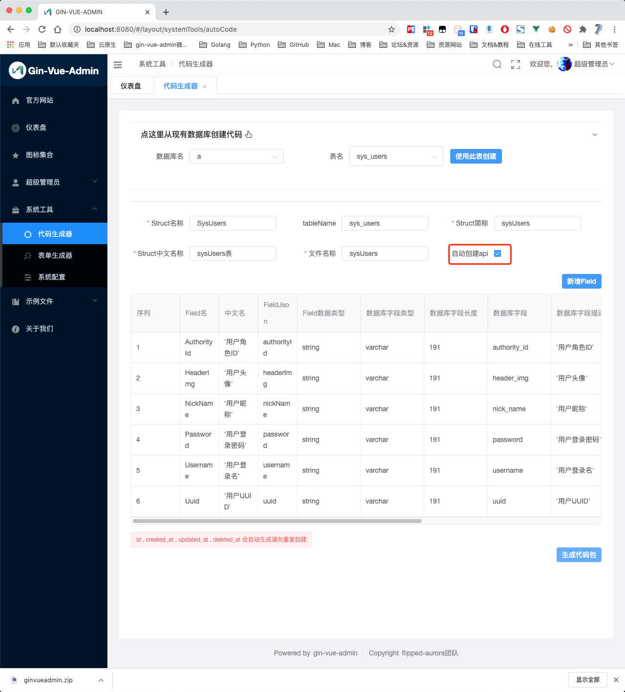

如果是自己写的业务代码，这里需要配置好后端接口。进入系统 `超级管理员` → api管理 菜单，点击 **新增api** 按钮，配置接口信息。

:::info 注意

如果不知道怎么写,可以看看 [代码](https://github.com/flipped-aurora/gin-vue-admin/blob/master/server/service/sys_auto_code.go#L254) 

```go
//@author: [piexlmax](https://github.com/piexlmax)
//@author: [SliverHorn](https://github.com/SliverHorn)
//@function: CreateApi
//@description: 自动创建api数据,
//@param: a *model.AutoCodeStruct
//@return: error

func AutoCreateApi(a *model.AutoCodeStruct) (err error) {
	var apiList = []model.SysApi{
		{
			Path:        "/" + a.Abbreviation + "/" + "create" + a.StructName,
			Description: "新增" + a.Description,
			ApiGroup:    a.Abbreviation,
			Method:      "POST",
		},
		{
			Path:        "/" + a.Abbreviation + "/" + "delete" + a.StructName,
			Description: "删除" + a.Description,
			ApiGroup:    a.Abbreviation,
			Method:      "DELETE",
		},
		{
			Path:        "/" + a.Abbreviation + "/" + "delete" + a.StructName + "ByIds",
			Description: "批量删除" + a.Description,
			ApiGroup:    a.Abbreviation,
			Method:      "DELETE",
		},
		{
			Path:        "/" + a.Abbreviation + "/" + "update" + a.StructName,
			Description: "更新" + a.Description,
			ApiGroup:    a.Abbreviation,
			Method:      "PUT",
		},
		{
			Path:        "/" + a.Abbreviation + "/" + "find" + a.StructName,
			Description: "根据ID获取" + a.Description,
			ApiGroup:    a.Abbreviation,
			Method:      "GET",
		},
		{
			Path:        "/" + a.Abbreviation + "/" + "get" + a.StructName + "List",
			Description: "获取" + a.Description + "列表",
			ApiGroup:    a.Abbreviation,
			Method:      "GET",
		},
	}
	err = global.GVA_DB.Transaction(func(tx *gorm.DB) error {
		for _, v := range apiList {
			var api model.SysApi
			if errors.Is(tx.Where("path = ? AND method = ?", v.Path, v.Method).First(&api).Error, gorm.ErrRecordNotFound) {
				if err := tx.Create(&v).Error; err != nil { // 遇到错误时回滚事务
					return err
				}
			}
		}
		return nil
	})
	return err
}
```

:::

- 路径：就是接口路径，比如前端项目中 src → api → [PackageName](#packagename) .js 每个方法里的 url
- 请求：根据接口实际选择即可
- api分组：对应 struct 简称
- api简介：对api的简要说明

以上配置好后，点击 **确定** 按钮，完成接口配置。

## 5.配置角色权限

- 进入系统 `超级管理员` → `角色管理` 菜单，找到需要设置权限的角色，点击对应的 **设置权限** 按钮，配置角色相关权限。

- 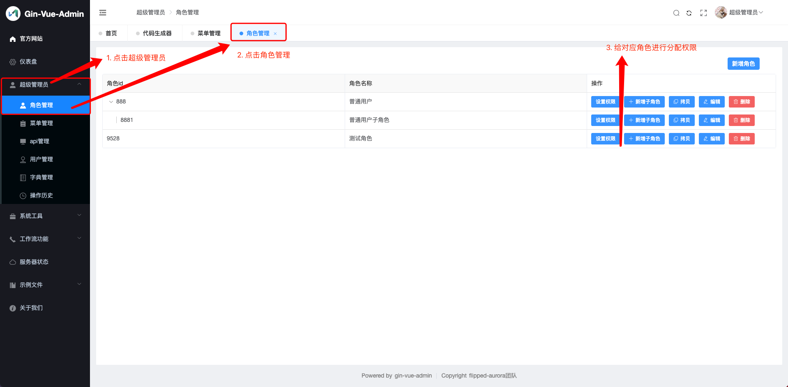

- 角色菜单：勾选该角色可以访问的目录菜单
- 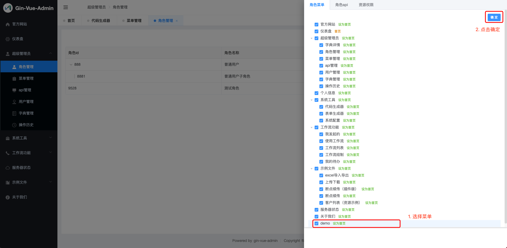
- 角色api：勾选该角色可以访问的接口
- 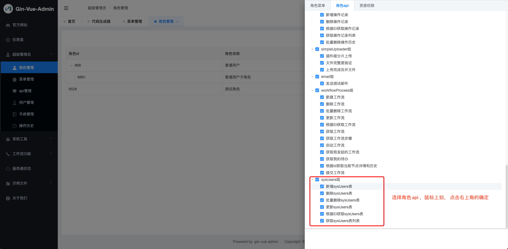

## 6：完善新增表单弹窗/页面 

:::info 注意

在 [v2.3.5](https://github.com/flipped-aurora/gin-vue-admin/releases/tag/v2.3.5) 版本后,不再需要手动创建表单, 如果你要自己定义表单,可以看看!

:::

以上6个步骤完成后，我们可以在系统中看到我们所创建的结构体数据列表页面。目前，这个页面已经是可以实现 **删除**、**查询** 功能了，**新增**、**修改** 功能仍然需要我们自己完善一下弹窗表单。

进入系统 系统工具 → 表单生成器 菜单，根据自己的实际需求，将左侧组件拖拽至中间画布区域，并在右侧设置组件属性。

- 组件类型：默认是左侧选中的组件类型，这里还可以再进行调整
- 字段名：对应 Step3 中的 **FieldJSON** 字段
- 标题：即组件label
- 占位提示：。。。就是占位提示

把所有组件上边几个基本的组件属性填好以后，点击画布上方的 **复制代码** 按钮，会出现一个弹窗，让我们选择 **生成类型** 是 页面 还是 弹窗。我用的时候选的页面，具体内容应该是没差的，这里选择哪个应该不影响我们目前的需求。然后点击 **确定** 按钮，就成功复制到了我们的表单代码。

接下来，

- 随便找个记事本或者地方，把代码复制到里边。
- 在复制出来的代码中，取出 `<el-form>……</el-form>` 部分代码，覆盖掉前端项目中 src → view →  [PackageName](#packagename)(自建) → [StructName](#structname).vue 中 `此处请使用表单生成器生成form填充 表单默认绑定 formData 如手动修改过请自行修改key` 这句话。
- 在复制出来的代码中，把 js 部分`data`方法里返回的对象复制到前端项目中，上边提及的 .vue 文件的 js 部分 `data` 方法的 `return` 对象里

## Finish

至此，一个单表基本业务结构体的数据列表显示，单表数据增加、删除、查找、更新功能全部搞定。


