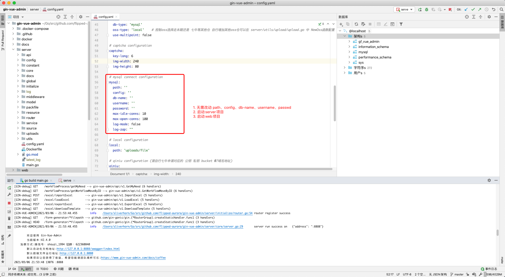
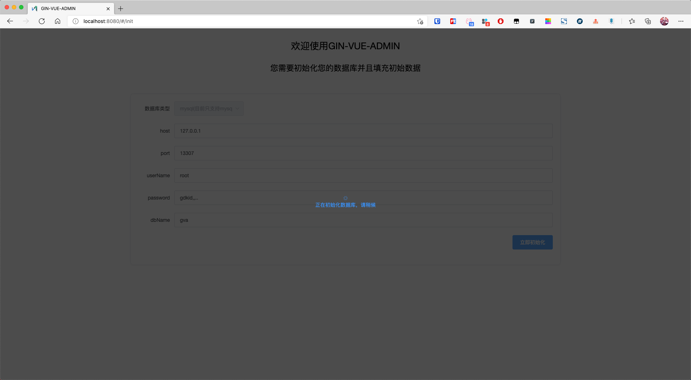

### 请对应版本进行观看初始化数据的方式!!!!!!!

#### V2.4.0~2.4.2

:::danger 注意

mac/linux/windows 都不需要配置 `server/config.yaml` 的 `mysql` 中的 `path` , `db-name`, `username ` ,`password`

:::

##### 1. 启动server项目 与 web项目



2. 在浏览器填写 `host`,`port `,`userName ` ,`password ` ,`dbName` , 点击立即初始化

   

3. 操作成功后会跳转到登录页面, 页面有一个`操作成功`的提示, 这就是初始化数据成功的标志

   

#### V2.3.4~V2.3.9

配置好 `server/config.yaml` 的 `mysql` 中的 `path` , `db-name`, `username ` ,`password`,其他的按需修改,我们 [flipped-aurora](https://github.com/flipped-aurora) 团队为各位使用者准备好了脚本

`windows` 用户

方式一(不可见错误报错):

- ```go
  // 开启 Go Modules模式并设置代理
  go env -w GO111MODULE=on
  go env -w GOPROXY=https://goproxy.io,direct
  ```

- 直接运行 `server` 目录下的 `initdb.bat` (双击)

方式二(可见错误报错):

- 以server为项目打开的,打开Goland的终端

```shell script
initdb.bat
```

`linux`, `mac` 用户

```shell
# 开启 Go Modules模式并设置代理, 已经设置的用户可跳过
go env -w GO111MODULE=on
go env -w GOPROXY=https://goproxy.io,direct

# 在server项目下,先构建gva终端工具
make gva
# 使用gva进行初始化数据, 如果不使用make initdb, 使用./gva initdb也是可以的
make initdb
```

:::danger 注意

mysql>=5.7版本的数据库，一定情况下会初始化失败，此时注意数据库编码设置为utf8-mb4，忽略掉时间0值校验，即可解决问题。使用命令行工具运行initdb，或者make可以查看到报错内容。

:::

> 使用gva终端工具进行初始化数据,理由如下:

- V2.3.0~V2.3.31所使用的方式，有人只会改成 `true` ,第二次启动就忘了改为 `false`, 导致server项目启动失败
- 方便新增数据，而不需要跟以前一样修改 `.sql` 文件
- gva终端初始化数据是通过代码+gorm的事务进行添加数据，大概率不同版本的mysql之间一些问题的，规避了字符集的问题问题而导致数据的导入失败，或者乱码问题

#### V2.3.0~V2.3.31

- `comfig.yaml` 的mysql的账号密码配置自行修改
- `config.yaml` 中的 `system` 下存在一行 `need-init-data: false` 将此参数设定为 `true` 
- 启动项目就自动通过代码方式进行初始化数据 

:::danger 注意

重启项目一定一定一定要记得  `need-init-data: false` 将此参数设定为 false 
:::

#### V2.0.0~V2.2.0

- 自行新建数据库，并导入server/db的qmPlus.sql
